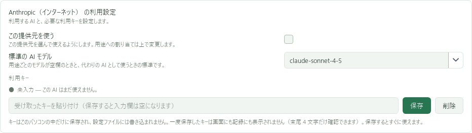

# Anthropic・ClaudeのAPIキーを用意する

Claudeを使う場合、VACでは **「Anthropic（インターネット）」** を選びます。
通常のClaudeチャット画面ではなく、Claude ConsoleでAPIを準備します。

## 1. Claude Consoleにログインする

[Claude Console](https://platform.claude.com/)を開きます。組織・ワークスペースを選ぶ場合は、VACで利用するものを選んでください。

ClaudeのPro・Maxなどのチャット向け契約と、API・Consoleの利用料は別です。
[公式説明：Claudeの契約とAPI料金](https://support.claude.com/en/articles/9876003-i-have-a-paid-claude-subscription-pro-max-team-or-enterprise-plans-why-do-i-have-to-pay-separately-to-use-the-claude-api-and-console)

## 2. API利用の残高を用意する

Consoleの **Settings → Billing** で支払い方法と残高を確認します。
通常の前払い方式では「Buy credits」からクレジットを購入します。自動追加購入（Auto-reload）を有効にする場合は、その条件も確認してください。
請求書払いなどの契約では手順が異なります。[公式：APIの支払い方法](https://support.claude.com/en/articles/8977456-how-do-i-pay-for-my-claude-api-usage)

## 3. APIキーを発行する

1. **Settings → API keys** を開く。
2. **Create key** を選ぶ。
3. 「VAC用」などの名前を付け、対象のアカウント・ワークスペース・期限を確認する。
4. 作成されたキーをコピーする。

通常のAPI利用キーを使います。組織管理用のAdminキーや、AWS / Google Cloud用の認証情報をVACへ貼り付ける手順ではありません。
発行画面が異なる場合は[公式のキー作成手順](https://platform.claude.com/docs/en/manage-claude/authentication)を確認してください。

## 4. VACに登録する

「AI の設定」の「Anthropic（インターネット）の利用設定」で、キーを貼り付けて **「保存」** を押します。

上の「まとめて切り替え」でAnthropicと利用できるClaudeモデルを選び、**「まとめて切り替える」** を押します。
[登録手順の詳細](register.md)

## うまくいかないとき

残高不足、利用回数の制限、キーの期限、ワークスペースの権限を確認します。
モデル名にはAPIで使える正式なIDを指定してください。画像のモデル名は撮影時の例です。

料金は[Claude APIの公式料金案内](https://platform.claude.com/docs/en/about-claude/pricing)を確認してください。
公式情報の確認日：2026年9月16日。
