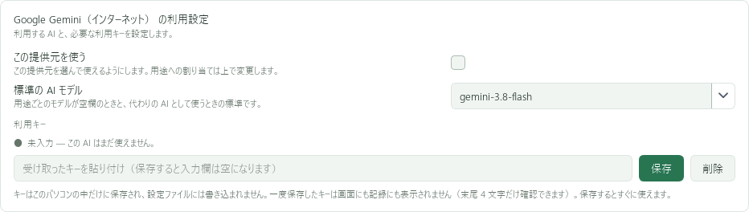

# Google GeminiのAPIキーを用意する

VACでは **「Google Gemini（インターネット）」** を選びます。
Google AI StudioでGemini APIのキーを用意してください。

## 1. Google AI Studioを開く

[Google AI StudioのAPIキー画面](https://aistudio.google.com/apikey)へGoogleアカウントでログインします。
初回は利用条件や利用可能な国・地域、年齢などの条件を確認してください。
Geminiのチャット用アプリにログインしただけでは、VACのAPI設定は完了しません。

## 2. プロジェクトと課金状態を確認する

APIキーはGoogle Cloudのプロジェクトに紐付きます。VAC用のプロジェクトを選ぶと、利用量を管理しやすくなります。
プロジェクトが表示されない場合は、AI StudioのProjectsから既存プロジェクトを取り込む操作を確認してください。

無料枠の対象モデルや回数には制限があります。課金を有効にする前に、[料金表](https://ai.google.dev/gemini-api/docs/pricing)と[課金の説明](https://ai.google.dev/gemini-api/docs/billing)を読み、無料・有料の状態を確かめます。
キーごとに独立した請求設定があるわけではなく、所属先の設定が影響します。

## 3. 新しいキーを作成する

1. APIキー画面の **Create API key** を選ぶ。
2. 使用するプロジェクトを選び、キーを作成する。
3. 作成されたキーをコピーする。

**古いGoogle Cloud用キーを使い回さず、AI Studioの現行手順で発行してください。**
2026年9月確認時点の公式案内では、StandardキーからAuthキーへの移行が案内されています。
以前のキーで動かなくなった場合は、[公式のキー移行手順](https://ai.google.dev/gemini-api/docs/api-key#migrate-to-an-auth-key)に従い、VACに保存するキーも交換します。

## 4. 無料枠のデータの扱いを確認する

Googleは無償サービスについて、入力や出力をサービス改善に使用し、人による確認が行われる場合があると説明しています。
機密情報・個人情報を送らないよう案内されています。地域や課金状態によって適用条件が異なるため、[公式利用条件の「How Google Uses Your Data」](https://ai.google.dev/gemini-api/terms)を確認してください。

VACは会話の文脈や記憶も送ることがあります。他の人の会話を取り込む場合は、無料枠の有無だけで選ばず、この条件も確認してください。

## 5. VACに登録する

「AI の設定」の「Google Gemini（インターネット）の利用設定」で、キーを貼り付けて **「保存」** を押します。

上の「まとめて切り替え」でGoogle Geminiと利用可能な会話用モデルを選び、**「まとめて切り替える」** を押します。
[登録手順の詳細](register.md)

## うまくいかないとき

| 状況 | 確認すること |
| --- | --- |
| キーが無効・ブロックされた | キーの種類、漏えいによる停止、プロジェクトの権限。新しいキーで再設定 |
| 429・回数制限 | 無料枠・利用回数の上限。少し待ち、AI Studioで利用状況を確認 |
| モデルが使えない | モデルID、提供地域、無料枠の対象、プロジェクトの課金状態 |

公式情報の確認日：2026年9月16日。アカウント条件により表示や手順が異なります。
