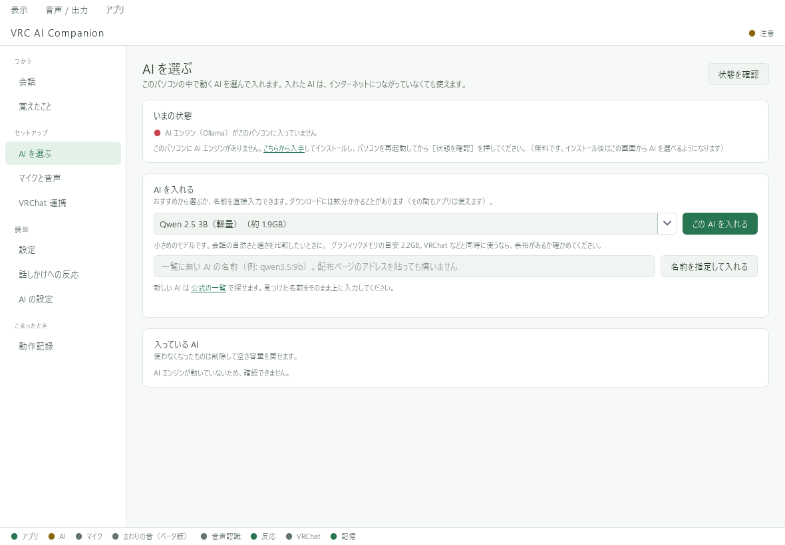

# Ollamaをパソコンに入れる

Ollamaは、パソコン内で会話用AIモデルを動かすためのソフトです。
VACとOllama本体、会話用モデルは別々に用意します。

## 1. Ollamaをインストールする

[Ollama公式ダウンロード](https://ollama.com/download/windows)からWindows版を取得し、インストールして起動します。
詳しい動作条件は[Windows向け公式説明](https://docs.ollama.com/windows)を参照してください。

## 2. VACで会話モデルを入れる

初回セットアップ画面が開いている場合は、先に「セットアップをスキップ」で進めます。

1. VACの **「AI を選ぶ」** を開く。
2. **「状態を確認」** を押す。
3. おすすめ一覧から、PCの空きメモリに合うモデルを選ぶ。
4. **「この AI を入れる」** を押し、ダウンロードの完了を待つ。一覧にないモデルは **「名前を指定して入れる」** から指定できます。

*画像はOllama未接続の例です。実際にはOllamaを起動して状態を確認してください。*

このページのおすすめ一覧は**これから導入する候補**です。表示されていても導入済みとは限りません。
「この AI を入れる」で取得し、完了表示を確認してから会話に使います。

VRChatと同時に使う場合は、VRChatが使用するメモリの余裕も必要です。
最初から大きなモデルを選ぶより、小さめのモデルで速度と会話を確認してから変更すると分かりやすくなります。

## 3. 会話に使うモデルへ切り替える

「AI の設定」の「まとめて切り替え」で **「このパソコンの AI」** とダウンロード済みモデルを選び、**「まとめて切り替える」** を押します。
ローカルOllamaを使う場合、VACへのクラウドAPIキー登録は不要です。

## 外部送信を避けたい場合

ダウンロード済みのローカルモデルを使い、会話以外の用途にもクラウドAIが設定されていないことを確認します。
Ollamaのクラウドモデルは、このページで案内するローカル実行とは別です。

返事が遅い場合は、モデルを小さくする、返答を短くする、VRChatの負荷を軽くする、といった順に試します。

**次へ：[文字で動作確認](../getting-started/setup.md) → [マイクの設定](../audio/microphone.md)**
