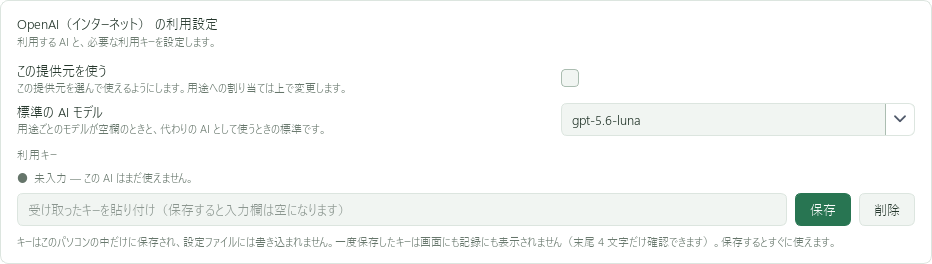
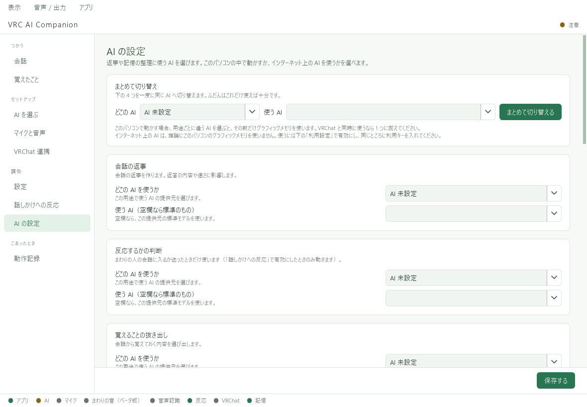

# キーの登録とAIの切り替え

APIキーを用意したら、左の **「AI の設定」** を開きます。
初回セットアップで登録済みの場合は、キーを再入力せずに状態を確認できます。

## 1. 利用キーを保存する

1. ページを下へスクロールし、使う提供元の「利用設定」を探す。
2. 「利用キー」欄に、その提供元で発行したAPIキーを貼り付ける。
3. 欄の右側の **「保存」** を押す。
4. **「設定済み」** の表示を確認する。

**保存後に入力欄が空になるのは正常です。** 保存状態と末尾のヒントで確認します。
ページ下部の「保存する」と、利用キー欄の「保存」は別の操作です。

## 2. 使うAIを選ぶ

ページ上部に戻り、「まとめて切り替え」を使います。

1. 「どこの AI」で提供元を選ぶ。
2. 「使う AI」で会話用モデルを選ぶ。候補にない場合は、提供元が案内する正式なモデルIDを入力する。
3. **「まとめて切り替える」** を押す。

この操作で、会話・反応判断・記憶の抜き出し・要約の4用途を同じ提供元とモデルに揃えます。
選んだ提供元も有効になります。必要なAPIキーは手順1で保存してください。

用途別に変更する場合は、それぞれの項目を変更してページ下部の **「保存する」** を押します。

## 3. 短い文字入力で確認する

「会話」で「こんにちは」と送信し、返答を確認します。
キーを保存できたことと、APIが利用できることは別です。返答がない場合は[困ったとき](../troubleshooting.md)を確認してください。

## キーを交換・削除する

新しいキーを同じ欄へ貼り付けて「保存」を押すと交換できます。
「削除」はVAC側の保存を削除する操作です。外部サービス側の失効・請求停止は、提供元の管理画面で行ってください。
