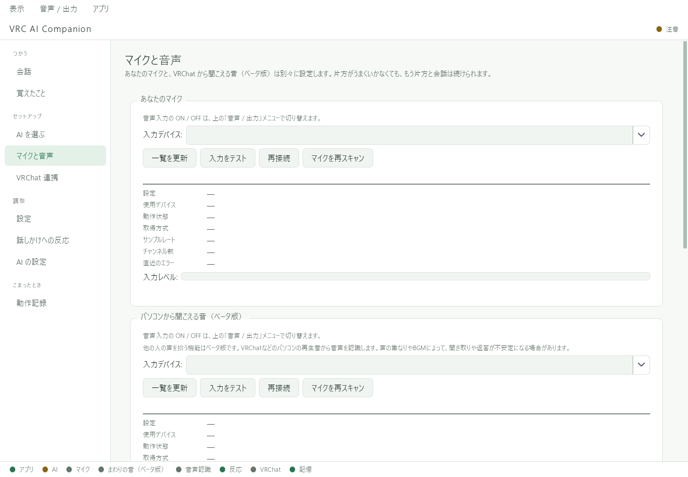

# 自分のマイクで話す

先に「会話」の文字入力で返答することを確認してください。文字で返答しない場合は、[AIの設定](../ai/register.md)を先に直します。

## 1. マイクを選ぶ

1. マイクを接続し、Windowsのサウンド設定で入力できることを確認する。
2. VACの **「マイクと音声」** を開く。
3. **「あなたのマイク」** の **「マイクを再スキャン」** を押す。
4. 完了したら **「入力デバイス」** で使いたいマイクを選ぶ。

*画像は未接続の撮影環境です。実際のマイク名は、お使いの機器によって異なります。*

「一覧を更新」は保存済みの検出結果などを読み直す操作です。
新しいマイクを接続した場合や候補が出ない場合は、「マイクを再スキャン」を使います。

## 2. 入力をテストして保存する

選んだマイクで **「入力をテスト」** を押し、数秒話します。
「音声を取得できました」が表示されたら、ページ下部の **「保存する」** を押してください。

入力テストの成功は、音が取得できたことを示します。文字起こしやAIの返答まで成功したことを示すものではありません。

## 3. マイク入力をオンにする

上部メニュー **「音声 / 出力」** から自分のマイク入力をオンにします。
音声認識モデルの取得・準備が表示された場合は待ちます。[初回取得とGPUの説明](models.md)

短い一文を話し、少し間を空けて「会話」画面の認識文と返答を確認します。
AIが考えている間に話し始めた音声は、設定によって聞き流されます。

## マイクが止まっていたら

- ケーブルの接続や、Windows側の入力デバイスを確認する。
- 「音声 / 出力」で入力がオンか確認する。
- 「マイクと音声」の **「再接続」** を押す。
- 自動停止を設定している場合は、一定時間使わないと自分のマイクだけがオフになる。

**改善しない場合：[困ったとき](../troubleshooting.md)**
