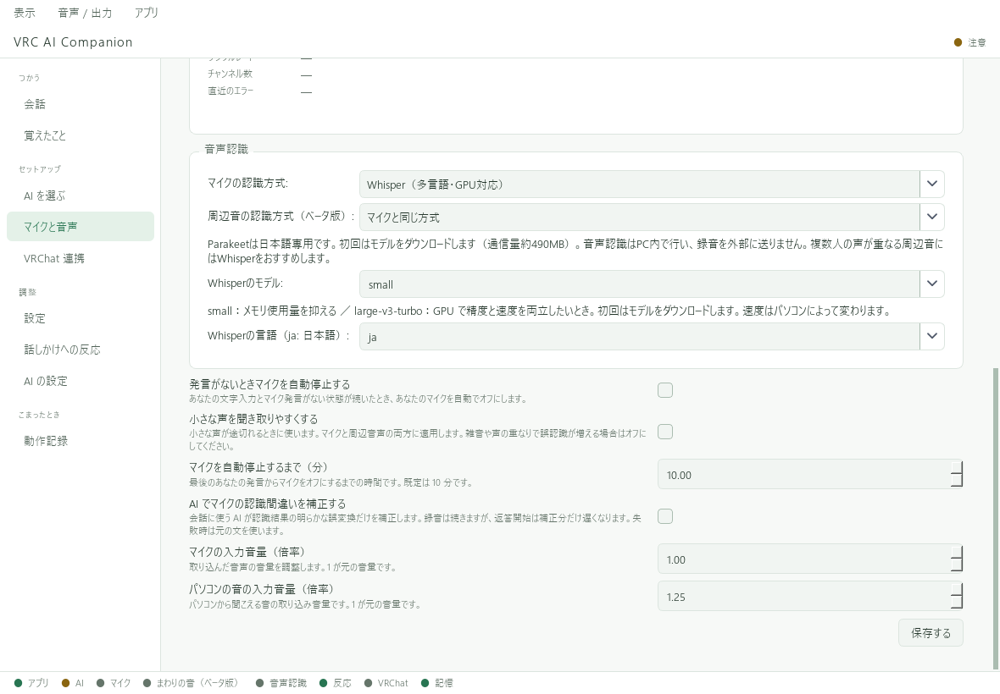

# 音声認識モデルとGPU

「音声認識モデル」は声を文字にするものです。「AI の設定」で選ぶ会話用モデルとは別です。

## 認識方式を選ぶ

「マイクと音声」を下へスクロールすると、自分のマイクと周囲の音の認識方式を選べます。

| 方式 | 特徴 |
| --- | --- |
| Whisper | CPUまたは対応するNVIDIA GPUで処理。モデルの大きさによって速度・メモリ使用量が変わる |
| Parakeet | 日本語の認識をCPUで処理。Whisperとは得意・不得意が異なる |

どちらでも、声はこのパソコン内で文字にします。認識精度はマイク・話し方・周囲の音で変わります。
変更後は **「保存する」** を押し、モデルの準備を待って同じ短文で比較してください。

## 初回のモデル取得

最初に使うモデルはインターネットからダウンロードします。回線やモデルによって時間がかかります。
完了までは認識できないことがあります。空き容量と接続を確認し、必要に応じて「再接続」でやり直してください。

## WhisperでNVIDIA GPUを使う場合

Windows配布版は、必要なGPU用部品を初回に自動取得します。ダウンロードは約1.36GBです。
取得画面で **「CPUで続ける」** を選ぶこともできます。

- CPUやParakeetで使う場合は、このGPU用部品は取得しません。
- 取得に失敗・中止した場合は、CPUで継続します。CPUでは待ち時間が長くなる場合があります。
- 再試行するときは、空き容量と接続を確認して「マイクと音声」で「再接続」を押します。
- 取得済みの同じ版の部品は再利用します。

容量の目安は[動作環境](../getting-started/requirements.md)を確認してください。

## 認識文のAI補正

**「AI でマイクの認識間違いを補正する」** をオンにすると、自分のマイクの認識結果を会話用AIで補正します。
認識の誤りが必ず直るわけではありません。意図しない書き換えや遅さを感じたらオフにして比較してください。
クラウドAIを使う場合、この補正にも外部送信とAPI利用が発生します。
