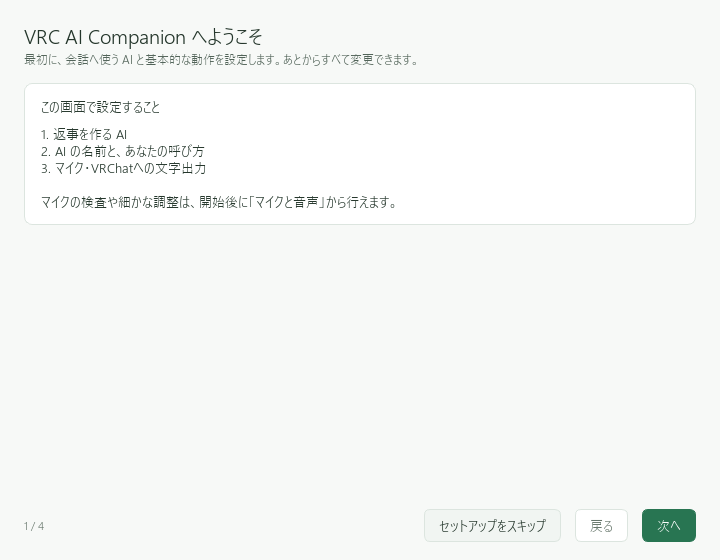
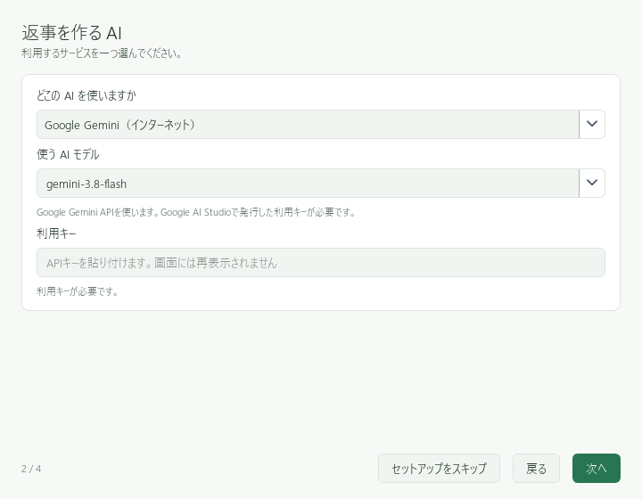
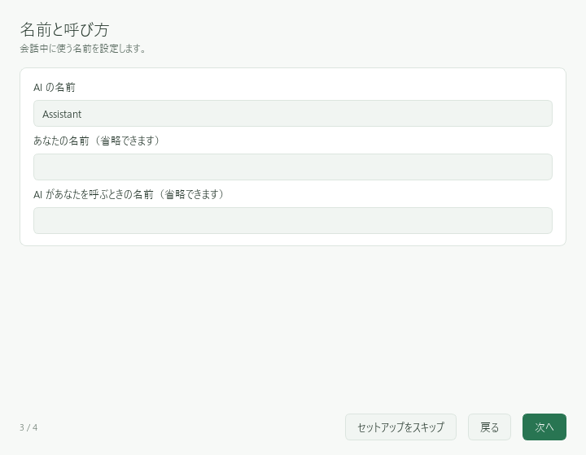
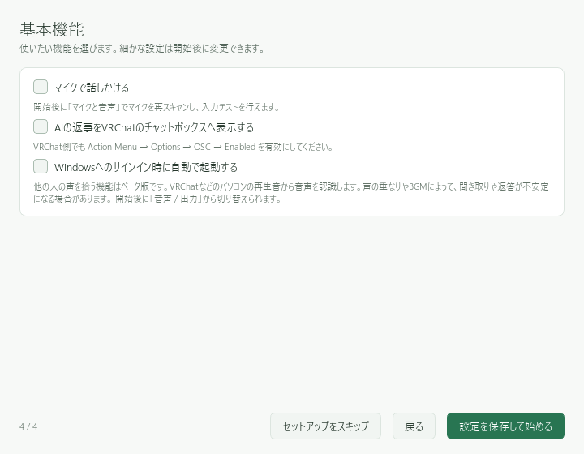

# 初回セットアップ

この画面では、会話用AI・名前・基本機能を順に設定します。あとから変更できます。

## 1. 返事を作るAIを選ぶ

「次へ」を押し、「どこの AI を使いますか」で提供元を選びます。
「使う AI モデル」には、選んだ提供元で利用可能な会話用モデルを指定します。
クラウドAIでは「利用キー」にAPIキーを貼り付けます。

画像のモデル名は撮影時の例です。選択肢にあるモデルでも、提供元側で提供終了・権限制限となっている場合があります。
選び方とキーの取得は、[AIの準備](../ai/README.md)を参照してください。

## 2. 名前を決める

「AI の名前」を入力します。「あなたの名前」「AI があなたを呼ぶときの名前」は省略できます。

## 3. 基本機能を選ぶ

最初はマイク・VRChat表示をオフにして、文字入力の動作確認から始めると切り分けやすくなります。
Windowsへのサインイン時の自動起動も、必要になってからオンにできます。

**「設定を保存して始める」** を押します。モデルの取得が表示されたら、完了を待ってください。

## 4. 「会話」で返答を確かめる

左の「会話」を開き、下の入力欄に「こんにちは」と入力して「送信」を押します。
返答が出れば、会話用AIの準備は完了です。

「AI 未設定」や固定の確認用メッセージが出る場合は、[キーの登録とAIの切り替え](../ai/register.md)を確認してください。
文字で返答することを確かめてから、[マイク](../audio/microphone.md)と[VRChat表示](../vrchat/README.md)を設定します。

*画像は未接続の撮影環境です。キーは入力していません。*
