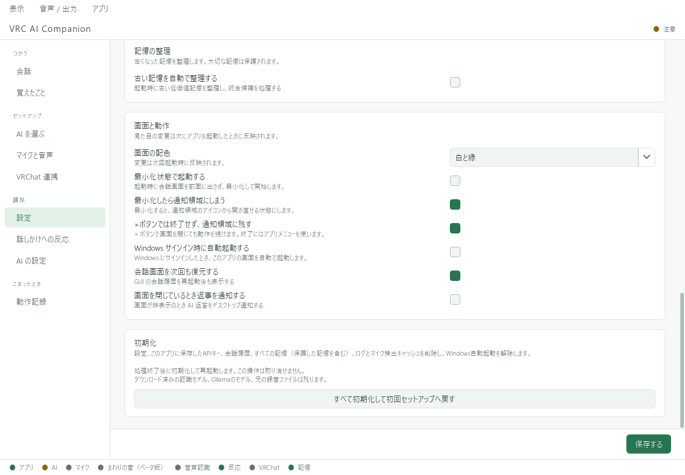

# 更新・バックアップ・初期化

## 更新する前に

現在のアプリで **「アプリ → 終了」** を選び、完全に終了します。
利用中のアプリフォルダ全体を、自分だけがアクセスできる場所へコピーしてバックアップしてください。
バックアップにはAPIキー・会話・記憶が入るため、他の人へ渡さないでください。

## 新しい版へ更新する

1. BOOTHから新しい版の本体ZIP（末尾が **-app.zip**）をダウンロードする。旧版の単一ZIPも同じ手順で展開できる。
2. ZIPを **別のフォルダ** に展開する。まだ新版を起動しない。
3. 引き継ぐ場合は、旧フォルダの **config、data、.env** を新版へコピーする。
4. 新版の **VRC AI Companion.exe** を起動する。
5. 設定・会話・記憶・マイクを確認する。

**旧EXEや旧_internalを、新しい版へ重ねないでください。**
新しい版に個別の更新手順が付いている場合は、その手順を優先します。
.envが見つからない場合は、エクスプローラーで隠しファイルの表示も確認してください。

ショートカットや自動起動は、新しいEXEの場所を指すように設定し直します。
GPU部品はdataを引き継ぐと同じ版を再利用できます。モデルの保存先・版によっては再取得が必要です。

### 2026-09-21-kat-parakeet版への更新

新規設定の音声認識はParakeetになりました。引き継いだWhisper等の明示設定は維持します。
切り替える場合は「マイクと音声」で選び直して保存してください。
ムチォの小さい「っ」の表示を修正し、短文の中央寄せ設定を追加しました。[文字盤の設定](vrchat/mucho.md)も確認してください。

## 更新で問題が出た場合

新版を完全に終了し、バックアップした旧フォルダを使って戻します。
新版で移行済みの設定や記憶だけを旧版へ混ぜず、バックアップをフォルダ単位で復元してください。

## 最初から設定し直す

「設定」の下部にある **「すべて初期化して初回セットアップへ戻す」** を使います。画面の確認内容を読んで実行してください。

初期化では、設定・保存APIキー・記憶・会話履歴・ログ・検出キャッシュを削除し、Windowsの自動起動を解除します。
ダウンロード済みの認識モデル、Ollamaのモデル、元の録音ファイルは残ります。
取り消せないため、必要なデータは先にバックアップしてください。

初期化で外部AIの契約は解約されません。APIキーの失効や外部に送信済みのデータの削除は、提供元側で別途行います。

## 利用をやめる場合

Windowsの自動起動をオフにしてから完全終了し、不要になったアプリフォルダを削除します。
Ollamaや外部AIの契約、別の場所に保存されたモデルは別管理です。
