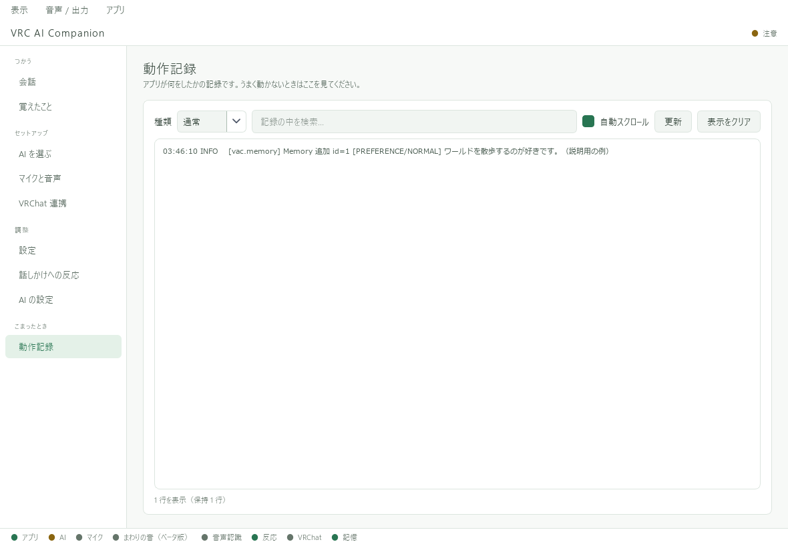

# 困ったとき

**文字入力 → マイク → VRChat表示** の順に確かめると、問題の場所を絞り込めます。

## 文字を入力しても返答がない

1. 「AI の設定」の「まとめて切り替え」で、使う提供元とモデルを選んだか確認する。
2. クラウドAIなら、対応する提供元の利用キーが「設定済み」か確認する。
3. 提供元の管理画面で、残高・利用上限・キーの有効期限を確認する。
4. Ollamaなら、本体が起動していてモデルがダウンロード済みか確認する。
5. 「動作記録」に出ているエラーを確認する。

| エラーの目安 | 確認すること |
| --- | --- |
| 401 / 認証に失敗 | キーの入力漏れ、無効化、期限切れ、提供元の取り違え |
| 403 / 利用できない | アカウント・地域・プロジェクト・モデルの権限 |
| 404 / モデルがない | APIで利用できる正式なモデルID。Webチャット上の呼び名と同じとは限らない |
| 429 / 制限 | 短時間の回数制限、割り当て、残高や利用上限。本文と提供元画面を確認 |
| 時間切れ / 接続失敗 | ネット接続、提供元の障害、ローカルAIの起動・負荷 |

エラー番号だけで原因が確定するわけではありません。連続して再送せず、表示内容を確認してください。

## 文字では返答するが、マイクでは返答しない

1. 「音声 / 出力」で自分のマイクがオンか確認する。
2. 「マイクと音声」でマイクを再スキャンし、目的の入力デバイスを選ぶ。
3. 「入力をテスト」で音が取得できるか確認し、「保存する」を押す。
4. 認識モデルの準備が終わっているか確認する。
5. AIが返答し終わってから、短い一文を話す。

入力テストが失敗する場合は、Windowsのマイク許可、機器の接続、別アプリによる占有を確認します。
接続先を変えた場合は「再接続」を試してください。[詳しいマイク設定](audio/microphone.md)

## マイクが重複して見える／未導入のモデルが候補にある

同じマイクへの接続方式や名前の省略が原因で、似た候補が並ぶ場合があります。
「マイクを再スキャン」の後に普段使う機器を選び、「入力をテスト」で確認してください。[候補の見分け方](audio/microphone.md)

配布識別「2026-09-18-ui-fixes」の版では、確認できた導入済みモデルを候補に表示します。Ollama起動・モデル導入後に「導入済みモデルを再確認」を押してください。
旧版では、候補名が表示されていても導入完了を意味しない場合があります。
「AI を選ぶ」でモデルの導入を確認してください。初回セットアップ中なら、スキップしてから導入できます。
[ローカルAIの準備](ai/ollama.md)

## 意図と違う文章になる

マイクとの距離を一定にし、BGMや別アプリの音を減らします。
一度に長く話すより、一文ずつ間を空けて試してください。
AI補正をオンにしている場合は、オフにして原文と比較します。
[認識方式の選び方](audio/models.md)

## 周囲の声を拾わない／音楽にも返答する

VRChatの再生先と取り込みデバイスを合わせます。Windowsの再生音を拾うため、他アプリの音も対象になる場合があります。
音楽を止め、一人ずつ話して試してください。返答が多い場合は[反応設定](usage/responses.md)を変更します。

## アプリには返答が出るが、VRChatに表示されない

VRChat側のOSC、VACの「VRChat に送る」、表示先が「表示しない」になっていないかを確認します。
文字盤を使う場合は、先に標準チャットボックスで動作を確認してください。
[VRChatの設定手順](vrchat/README.md)

## モデル取得が止まる／遅い

ネット接続と空き容量を確認します。GPU用部品の取得なら「CPUで続ける」を選べます。
音声認識モデルそのものは、認識に必要です。CPUに切り替えても認識モデルの取得が不要になるわけではありません。

## 閉じても動いている／起動しても画面がない

通知領域（タスクトレイ）のVACアイコンを確認してください。
終了は「アプリ → 終了」、再起動は「アプリ → 再起動」を使います。

## 解決しない場合

アプリの版・Windowsの版・操作手順・エラーの内容をまとめ、[お問い合わせ](support.md)へ進んでください。
APIキーやアプリフォルダ全体を送る必要はありません。
