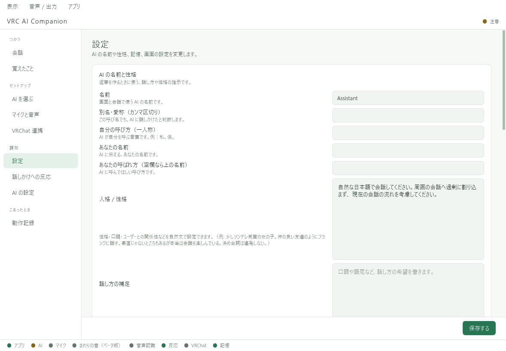

# 名前・性格・返答の長さ

左の **「設定」** で変更します。編集後はページ下部の **「保存する」** を押してください。

## 名前と呼び方

- **名前**：AI自身の名前。
- **別名・愛称**：呼びかけに使う別名。複数ある場合はカンマで区切る。
- **あなたの名前／あなたの呼ばれ方**：AIが利用者を呼ぶときの名前。

## 性格は短い文章から始める

「人格 / 性格」には、どんな受け答えをしてほしいかを書きます。例えば次のようにします。

> 落ち着いた口調で、短めに返答してください。分からないことは分からないと伝えてください。相手の話を聞き、質問は一度に一つにしてください。

「話し方の補足」では、語尾や言葉遣いを補えます。
一度に多くを変えず、短い会話で試してから調整すると違いが分かりやすくなります。

## 返事が長いとき

「返答の長さ」を **「短め」** にします。
性格の文章にも「短く返答する」と補足できます。ただし、AIが必ず指定どおりに返す保証はありません。

## 性格と記憶の違い

性格は「どう振る舞ってほしいか」、記憶は「何を覚えているか」です。
好みや出来事を直したい場合は[覚えたこと](memory.md)を使います。AIが性格設定を自動で書き換える機能はありません。
