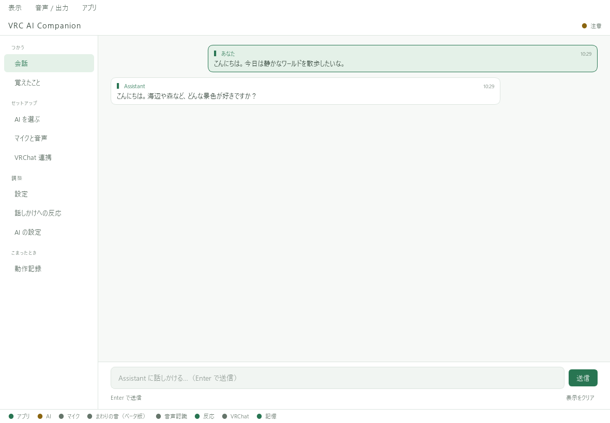

# 毎日の使い方と画面案内

## 普段の起動

1. VRChat表示を使う場合は、VRChatを起動する。
2. ローカルAIを使う場合は、Ollamaが起動していることを確認する。
3. **VRC AI Companion.exe** を起動する。
4. 上部の **「音声 / 出力」** で必要な入力・出力をオンにする。

使わない入力はオフにしておくと、意図しない音の取り込みやAPI利用を抑えられます。

## 画面の見方

| 左側のページ | できること |
| --- | --- |
| 会話 | 認識文と返答を見る。文字を入力して送信する |
| 覚えたこと | AIの記憶を検索・追加・修正・削除する |
| AI を選ぶ | Ollamaのローカルモデルを導入・管理する |
| マイクと音声 | 入力デバイス、認識方式、入力テストを設定する |
| VRChat 連携 | チャットボックス・対応文字盤への出力を設定する |
| 設定 | 名前・性格、見た目、履歴、自動起動などを変更する |
| 話しかけへの反応 | どんな場面で返答するかを設定する |
| AI の設定 | 提供元・会話モデル・APIキーを設定する |
| 動作記録 | エラーや処理の記録を確認する |

下部の状態表示は、どの機能に問題があるかを調べる手掛かりです。
入力・出力をオフにしている機能は、常に動いている必要はありません。

## 一時停止・終了

少し離れる場合は「音声 / 出力」でマイクや周囲の音声をオフにします。
完全に終了するときは **「アプリ → 終了」** を選びます。
閉じるボタンでは通知領域（タスクトレイ）に残ることがあります。

設定で再起動が必要と案内されたら、**「アプリ → 再起動」** を使ってください。

## 「表示をクリア」について

会話画面の **「表示をクリア」** は、その画面の表示を消す操作です。
会話の文脈・保存済み履歴・記憶をすべて消す操作ではありません。[データを整理する](memory.md)
