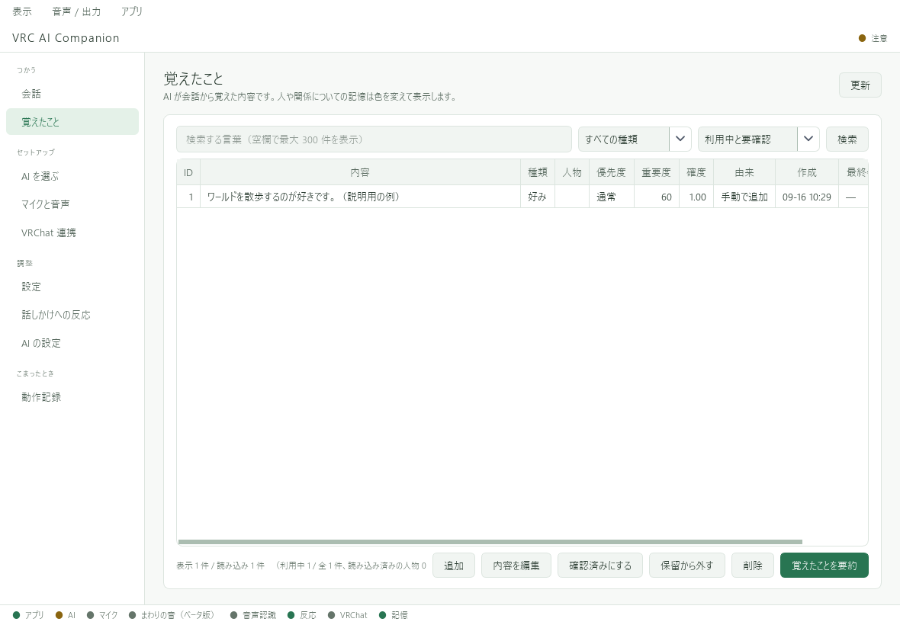

# 記憶と会話履歴

**会話履歴**はやり取りの記録、**記憶**は返事の参考にするために抜き出した情報です。
それぞれ別に管理されます。

## 覚えたことを確認する

左の **「覚えたこと」** を開きます。検索欄に言葉を入力し、種類などで絞り込めます。

内容を選び、編集や削除の操作を行います。
AIが誤って覚えた情報は、ここで確認・修正してください。会話で否定するだけで必ず保存内容が直るとは限りません。

## 自動で覚える設定

「設定」の「覚えかた」で **「会話を覚える」** と **「会話から自動で覚える」** を調整できます。
記憶は会話の直後に必ず追加されるわけではありません。内容や処理のタイミングによって追加されないこともあります。

古い記憶の自動整理も設定できます。「最重要」の記憶は自動削除しない扱いです。

## 履歴を消すときの注意

会話画面の「表示をクリア」は、保存済み履歴や記憶の削除ではありません。
保存設定をオフにしても、すでに保存された情報がすべて削除されるとは限りません。

設定・履歴・記憶・キーをまとめて消してやり直す場合は、[初期化](../maintenance.md)の説明を確認してください。
クラウドAIへすでに送信した情報は、VAC側で削除しても提供元側から消えるとは限りません。[データの取り扱い](../legal/privacy.md)
