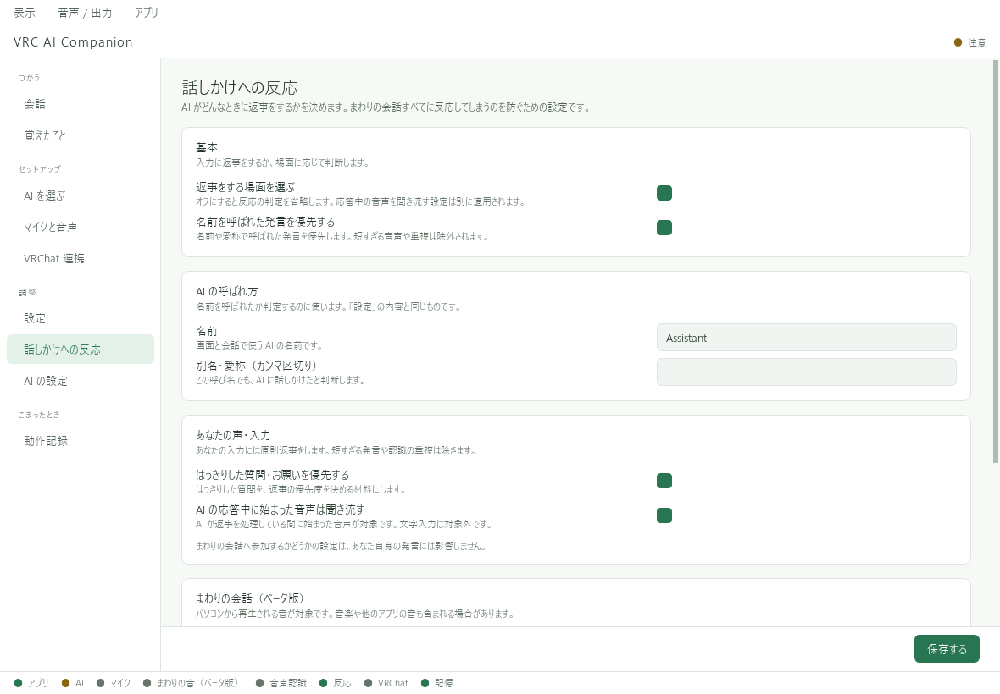

# 返事をする場面を選ぶ

左の **「話しかけへの反応」** で変更し、ページ下部の **「保存する」** を押します。

## あなたの声と文字入力

あなたからの入力には原則返答します。短すぎる音声や認識の重複などは除かれます。
「AI の応答中に始まった音声は聞き流す」がオンの場合は、AIが返し終えてから次の一文を話してください。
この聞き流しは文字入力には適用されません。

## 周囲の会話への反応を減らす

「まわりの会話（ベータ版）」の **「周囲の声にも、あなたの声と同じように返事する」** がオンだと、認識した周囲の発言にも原則返答します。

周囲への返答が多い場合は、まずこの項目をオフにします。
呼びかけや会話の流れから、返事をする場面を選ぶようになります。
「返事をする場面を選ぶ」もオンにして確認してください。

「名前を呼ばれていなくても、会話に入るか考える」は、選択的に反応する場合の参加方針です。
周囲への参加設定を変えても、あなた自身の入力への基本方針は変わりません。

## 迷ったときにAIで判断する

この機能をオンにすると、判断が難しい周囲の発言についてAIへ相談します。
少し待ち時間が増え、クラウドAIを割り当てている場合はAPI利用も増えることがあります。

反応の調整で解決しない場合は、周囲音声の取り込み自体を「音声 / 出力」でオフにできます。
