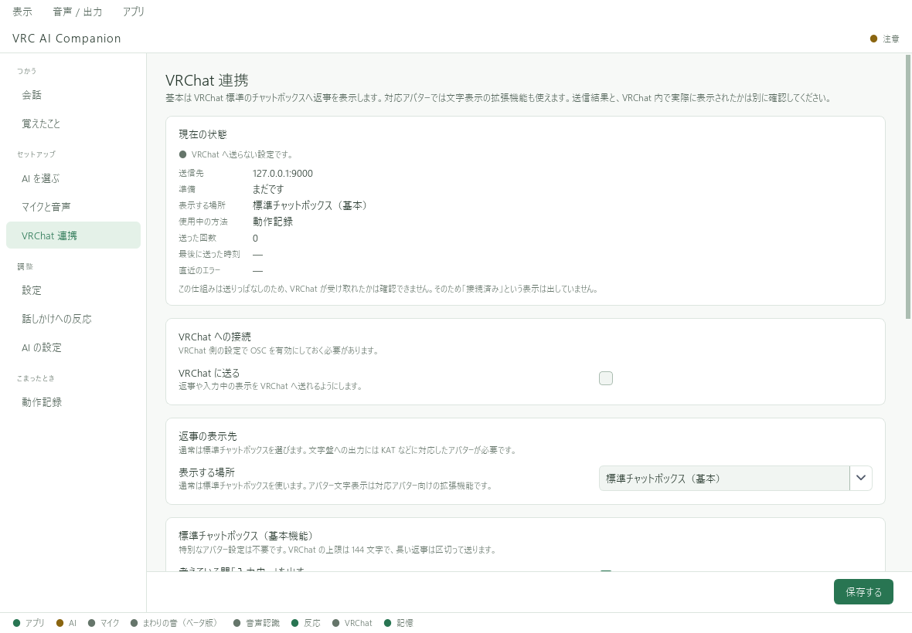
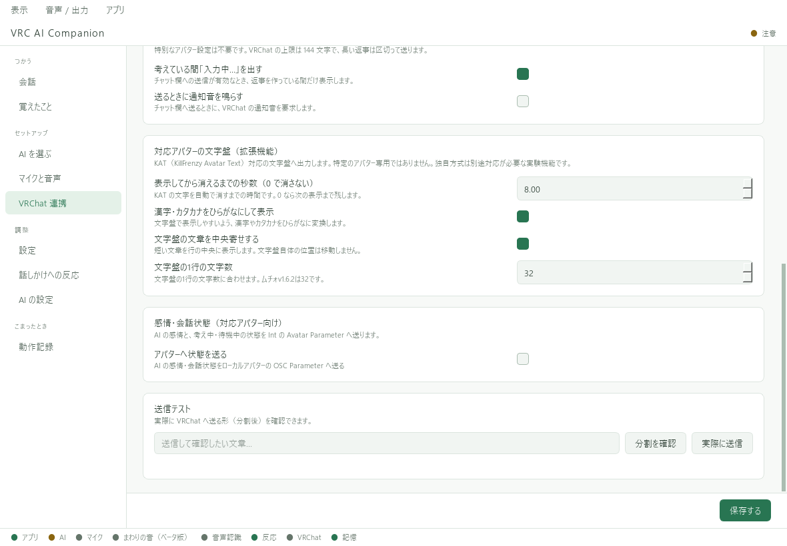

# ムチォ

ムチォの頭上の文字盤に、VRC AI Companion（VAC）が作った返答を表示するための手順です。
ここでは **「声をVACが文字にする → AIが返答を作る → ムチォの文字盤に表示する」** という使い方を案内します。

**ムチォで使用する際に、VRCPet.exeが起動している場合は、終了（休眠）してからVACを使用してください。**

ムチォはIWANUGA様の別売り製品です。導入ファイルとアバターへの追加方法は[ムチォの公式販売ページ](https://booth.pm/ja/items/8657397)・付属説明書を確認してください。VACにはムチォ本体を同梱していません。

## 連携できること・別に扱うこと

| 項目 | VACでの扱い |
| --- | --- |
| ムチォの文字盤への返答表示 | KAT方式で送信する。このページで設定する機能 |
| 名前・性格・会話の記憶 | VACの「設定」「覚えたこと」で管理する |
| VRCPetで育てた名前・性格・覚えた単語 | 自動では引き継がれない。必要な名前や性格はVACで設定する |
| ムチォ固有の成長・鳴き声・ふれあいなど | 文字盤への送信とは別。VACがVRCPetの全機能を再現するものではない |
| VACの「アバターへ状態を送る」 | ムチォ連携の必須設定ではない。標準のムチォがVACの感情・状態パラメータで動くことは確認していない |

ムチォの公式ページでは、文字盤に改変版KATを使用すると案内されています。VACはKAT方式の送信に対応していますが、**ムチォの全バージョン・改変状態での動作を保証するものではありません。** 使用中の版で、まず短文を表示して確認してください。
この案内はみつ屋によるVACの設定説明です。ムチォ作者様による公式連携・推奨を示すものではありません。

## 1. ムチォをアバターへ導入する

付属説明書に従ってムチォをアバターに追加し、VRChatへアップロードしてください。Modular AvatarやVRChat SDKの必要条件は、使用するムチォの版の案内を優先します。

VRChatで、そのムチォを導入したアバターに着替えます。別のアバターに切り替えたままだと、VACから送信しても文字盤は表示されません。

初めて導入する場合は、先に公式の手順でムチォ自体が表示・動作することを確かめると、問題を切り分けやすくなります。

## 2. VAC単体で会話を確認する

VACの **「会話」** に「こんにちは」と入力し、AIの返答が出ることを確認します。
返答が出ない場合は、先に[AIの設定](../ai/register.md)を済ませてください。ムチォの設定を変えても、APIキーや会話用モデルの問題は解決しません。

「設定」でAIの名前をムチォと同じ名前にすることもできます。[名前・性格の設定](../usage/character.md)

## 3. VRCPet.exeを終了（休眠）する

ムチォの文字盤にVACの返答を表示するときは、**起動中のVRCPet.exeを終了（休眠）してください。**
別のKAT送信アプリも終了し、VACだけで文字盤へ送信します。初回の動作確認だけでなく、通常使用時も同じです。
複数のアプリが同じ文字盤を書き換えると、文が混ざる・途中で消えるなどの競合が起きる可能性があります。

VRCPetを終了（休眠）した状態で、ムチォ固有の機能もすべて同じように動くとは限りません。
元の使い方へ戻すときは、VACの文字盤出力を止めてからVRCPetを起動します。VRCPetのファイルや保存データを削除する必要はありません。

## 4. VRChatのOSCをオンにする

VRChatのAction Menuで **OSC → Enabled** をオンにします。
場所が分からない場合は[VRChat公式のOSC設定案内](https://docs.vrchat.com/docs/osc-overview#enabling-it)を参照してください。

## 5. VACの表示先を文字盤にする

左の **「VRChat 連携」** を開き、次のように設定します。

| 項目 | 最初の確認で選ぶ内容 |
| --- | --- |
| VRChat に送る | オン |
| 表示する場所 | **標準チャットボックス＋対応アバターの文字盤** |
| 漢字・カタカナをひらがなにして表示 | オン |
| 文字盤の文章を中央寄せする | オン。短い文章を行の中央に表示 |
| 文字盤の1行の文字数 | ムチォv1.6.2では **32**。別の版や改変した文字盤は実際の行幅に合わせる |
| 表示してから消えるまでの秒数 | まずは初期値の8秒。読む時間が短ければ長くする |
| アバターへ状態を送る | 文字盤の確認ではオフのままでよい |

設定後は、ページ下部の **「保存する」** を押してください。

下へスクロールすると、文字盤の表示時間・ひらがな変換・中央寄せ・1行の文字数を設定できます。
中央寄せは文字の配置を調整する機能で、文字盤そのものの位置は移動しません。

最初にチャットボックスも併用すると、「VRChatへの送信」と「ムチォの文字盤への表示」を分けて確認できます。
文字盤だけでよくなったら、表示先を **「対応アバターの文字盤のみ（拡張）」** に変更して保存します。

## 6. 短いひらがなで表示を試す

1. 同じページの下部にある **「送信テスト」** の入力欄に `こんにちは` と入力する。
2. **「実際に送信」** を押す。「分割を確認」はプレビュー用なので、VRChatへは送信しない。
3. VRChat内で、ムチォの文字盤と標準チャットボックスの両方を見る。

送信処理が成功しても、文字盤への表示まで成功したとは限りません。必ずVRChat内で確認します。
表示できたら、VACの「会話」でAIの返答も表示されるか試してください。
最後に[マイク入力](../audio/microphone.md)をオンにして、声で話しかけます。

## うまく表示されないとき

| 状況 | 確認すること |
| --- | --- |
| チャットボックスにも出ない | VRChatのOSC、VACの「VRChat に送る」、設定の保存。まず[通常のVRChat連携](README.md)を確認 |
| チャットボックスだけに出る | 表示先が併用になっているか、今のアバターにムチォが入っているか。ムチォ側の表示設定も付属説明書で確認 |
| 文が混ざる・途中で消える | VRCPet.exeが起動している場合は終了（休眠）する。ほかのKAT送信アプリも終了し、VACの表示時間が短すぎないか確認 |
| 漢字や記号が「?」になる | ひらがな変換をオンにし、まず `こんにちは` で試す。文字盤のフォント・対応文字・版によって表示できる文字は異なる |
| 短い文章が左に寄る | 中央寄せをオンにして保存。ムチォv1.6.2の1行は32文字。「はいよ」などで確認する |
| 小さい「っ」が「ッ」になる | 配布識別「2026-09-21-kat-parakeet」へ更新する。この版でムチォv1.6.2の文字番号に修正。「ちょっと」で確認する |
| 一部の文字だけ位置がずれる・欠ける | ムチォやフォントの版・改変内容を確認。問い合わせ時はその版と、再現する短文を添える |
| 文字は出るが、表情や鳴き声が連動しない | 文字盤への送信とムチォ固有の機能は別。VACの感情・状態送信をオンにするだけで連動するとは限らない |

## 元のムチォとデータの扱いが変わる点

VACでクラウドAIを選ぶと、認識した文章・会話の流れ・参照する記憶などがそのAI提供元へ送られ、API料金が発生する場合があります。
ムチォの元のアプリの説明にあるローカル処理の条件を、そのままVACへ当てはめないでください。
[料金とAPIキーの注意点](../ai/costs-and-keys.md)・[データの取り扱い](../legal/privacy.md)も確認してください。

周囲の人の声も取り込む場合は、[周囲の音声入力](../audio/nearby.md)を別途設定します。相手への説明と必要な同意、利用場所のルールも確認してください。

VAC側の説明対象：0.5.0ベータ版。ムチォ公式情報の確認日：2026年9月16日。
